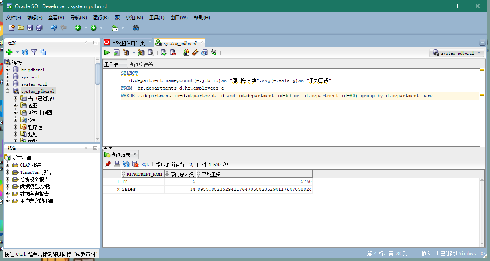

# Test1
## 郑玉铃 201810414204 18软工2班
## 实验目的
分析SQL执行计划，执行SQL语句的优化指导。理解分析SQL语句执行计划的重要作用。
## 实验内容
#### 对Oracle12c中的HR人力资源管理系统中的表进行查询与分析。
#### 首先运行和分析教材中的样例：本训练任务目的是查询两个部门('IT'和'Sales')的部门总人数和平均工资，以下两个查询的结果是一样的。但效率不相同。
#### 设计自己的查询语句，并作相应的分析，查询语句不能太简单。
### 查询1：
set autotrace on

SELECT d.department_name,count(e.job_id)as "部门总人数",
avg(e.salary)as "平均工资"
from hr.departments d,hr.employees e
where d.department_id = e.department_id
and d.department_name in ('IT','Sales')
GROUP BY d.department_name;
#### 查询结果

#### 执行指导

#### 优化建议

#### 分析
查询结果共提取2行，用时1.579秒。

### 查询2：
set autotrace on

SELECT d.department_name,count(e.job_id)as "部门总人数",
avg(e.salary)as "平均工资"
FROM hr.departments d,hr.employees e
WHERE d.department_id = e.department_id
GROUP BY d.department_name
HAVING d.department_name in ('IT','Sales');
#### 查询结果

#### 执行指导

#### 优化建议

#### 分析
查询结果共提取2行，用时0.069秒。

### 查询3：
SELECT
   d.department_name,count(e.job_id)as "部门总人数",avg(e.salary)as "平均工资"
FROM  hr.departments d,hr.employees e
WHERE e.department_id=d.department_id and (d.department_id=60 or  d.department_id=80) group by d.department_name
#### 查询结果

#### 执行指导

#### 优化建议

#### 分析
查询结果共提取2行，用时0.307秒。

## 实验总结
根据查询出结果所用的时间分析得出查询2的SQL语句是最优的，其次是查询3，最后是查询1。