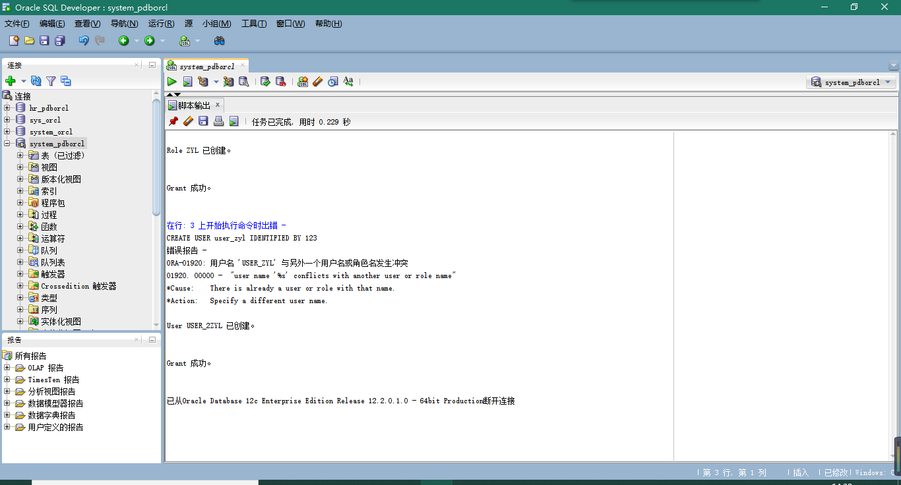
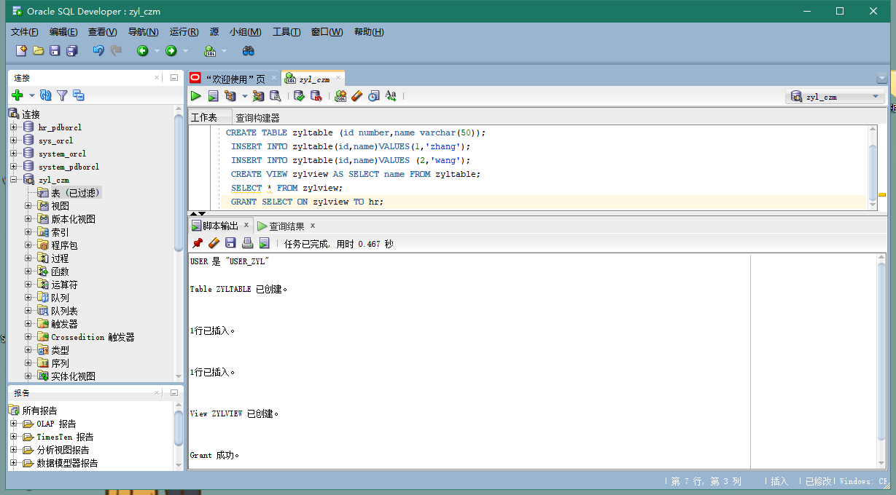
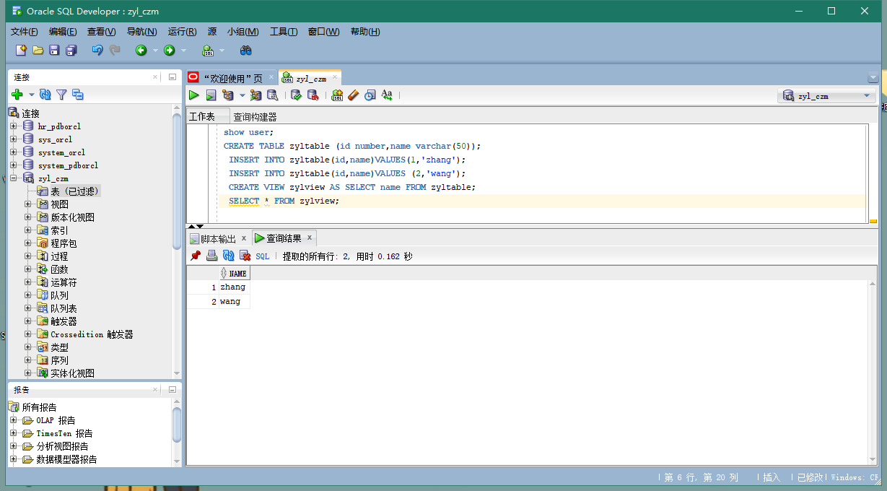
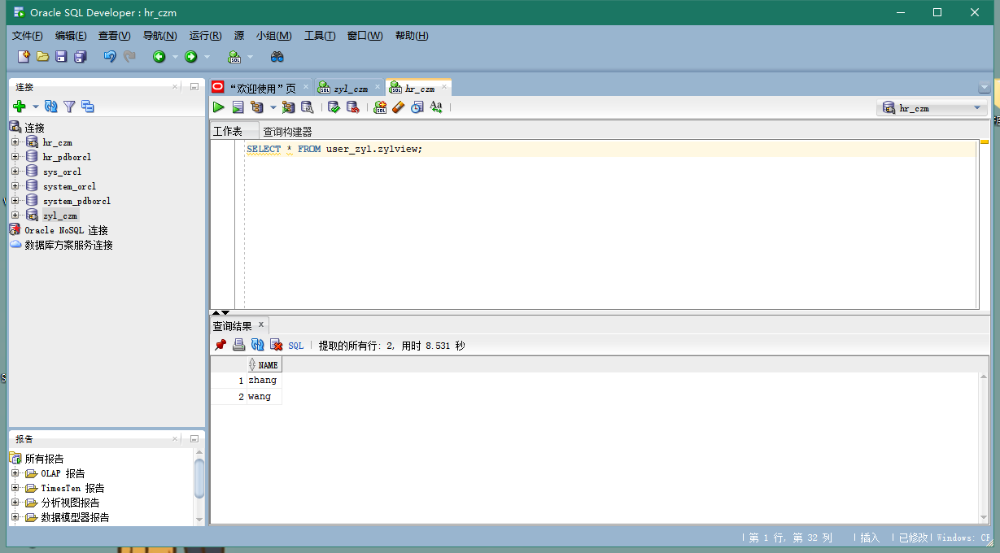
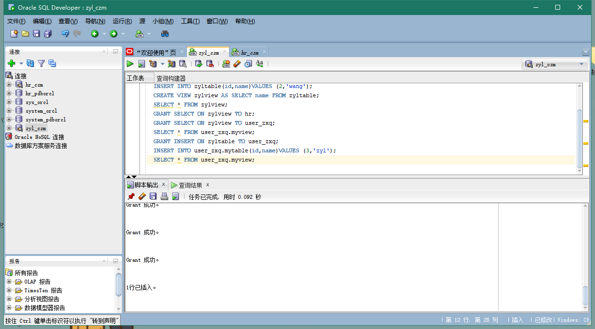
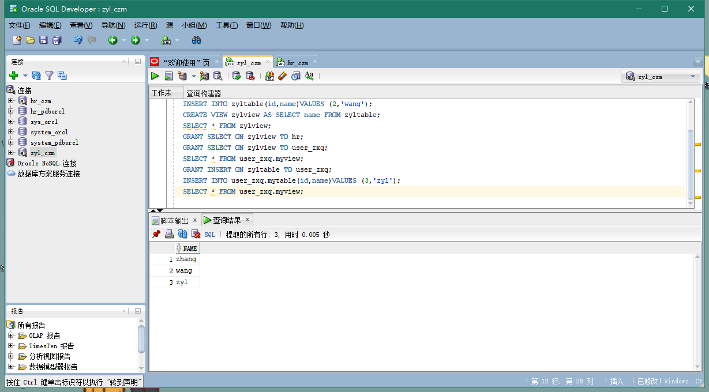
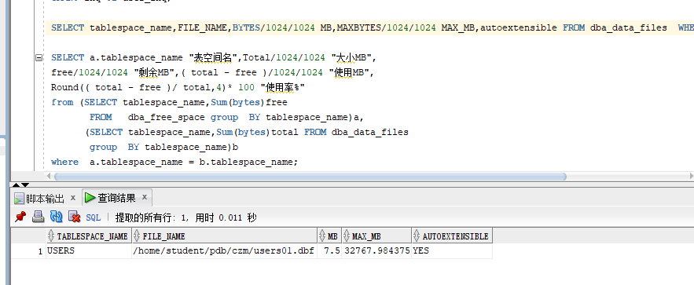
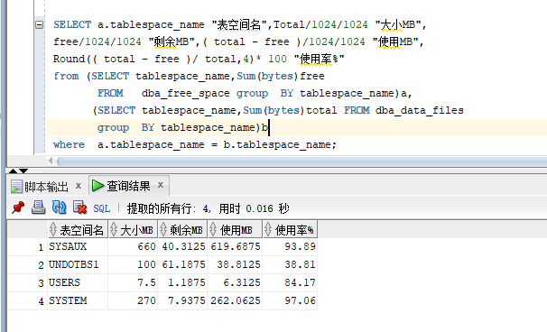

# Test2
## 郑玉铃 201810414204 18软工2班
## github用户名：zyl1075872605
## 实验目的
掌握用户管理、角色管理、权根维护与分配的能力，掌握用户之间共享对象的操作技能。
## 实验内容
Oracle有一个开发者角色resource，可以创建表、过程、触发器等对象，但是不能创建视图。本训练要求：

1、在pdborcl插接式数据中创建一个新的本地角色con_res_view，该角色包含connect和resource角色，同时也包含CREATE VIEW权限，这样任何拥有con_res_view的用户就同时拥有这三种权限。

2、创建角色之后，再创建用户new_user，给用户分配表空间，设置限额为50M，授予con_res_view角色。

3、最后测试：用新用户new_user连接数据库、创建表，插入数据，创建视图，查询表和视图的数据。
## 实验步骤
第1步：以system登录到pdborcl，创建角色con_res_view和用户new_user，并授权和分配空间：

    $ sqlplus system/123@pdborcl
    SQL> CREATE ROLE zyl;
    Role created.
    SQL> GRANT connect,resource,CREATE VIEW TO zyl;
    Grant succeeded.
    SQL> CREATE USER user_2zyl IDENTIFIED BY 123 DEFAULT TABLESPACE users TEMPORARY TABLESPACE temp;
    User created.
    SQL> ALTER USER user_2zyl QUOTA 50M ON users;
    User altered.
    SQL> GRANT zyl TO user_2zyl;
    Grant succeeded.
    SQL> exit

第2步：新用户new_user连接到pdborcl，创建表zyltable和视图zylview，插入数据，最后将zylview的SELECT对象权限授予hr用户。

    $ sqlplus user_zyl/123@pdborcl
    SQL> show user;
    USER is "USER_ZYL"
    SQL> CREATE TABLE zyltable (id number,name varchar(50));
    Table created.
    SQL> INSERT INTO zyltable(id,name)VALUES(1,'zhang');
    1 row created.
    SQL> INSERT INTO zyltable(id,name)VALUES (2,'wang');
    1 row created.
    SQL> CREATE VIEW zylview AS SELECT name FROM zyltable;
    View created.
    SQL> SELECT * FROM zylview;
    NAME
    --------------------------------------------------
    zhang
    wang
    SQL> GRANT SELECT ON zylview TO hr;
    Grant succeeded.
    SQL>exit

第3步：用户hr连接到pdborcl，查询user_zyl授予它的视图zylview

    $ sqlplus hr/123@pdborcl
    SQL> SELECT * FROM user_zyl.zylview;
    NAME
    --------------------------------------------------
    zhang
    wang
    SQL> exit

将zylview的SELECT对象权限授予user_zxq用户，获取user_zxq.mytable的写入权限，写入一条数据：

读取user_zxq.myview:

## 数据库和表空间占用分析
当全班同学的实验都做完之后，数据库pdborcl中包含了每个同学的角色和用户。 所有同学的用户都使用表空间users存储表的数据。 表空间中存储了很多相同名称的表mytable和视图myview，但分别属性于不同的用户，不会引起混淆。 随着用户往表中插入数据，表空间的磁盘使用量会增加。

## 查看数据库的使用情况
以下样例查看表空间的数据库文件，以及每个文件的磁盘占用情况。

## 实验总结

通过本次实验，我了解并掌握了数据库用户管理、角色管理、权根维护与分配的方法，掌握用户之间共享对象的操作技能。