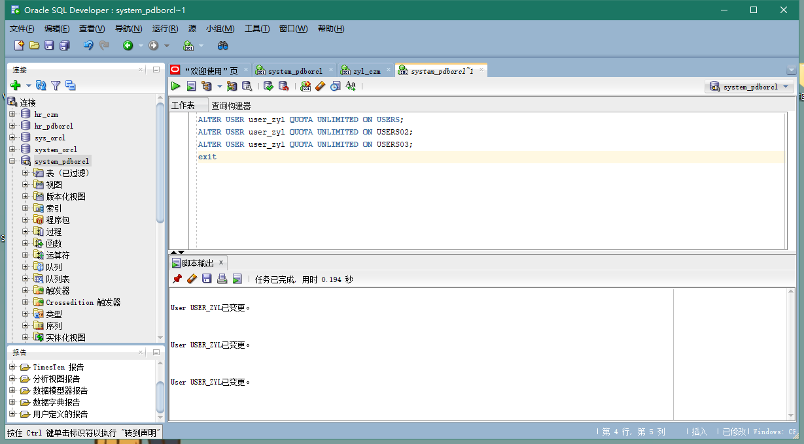
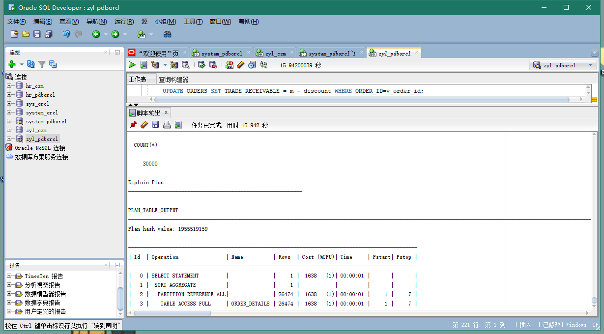
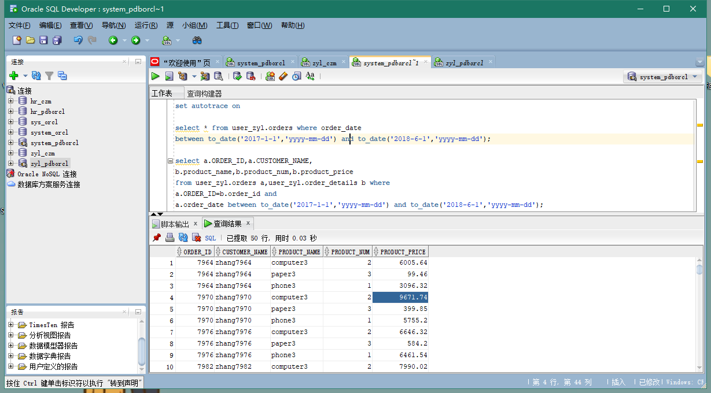
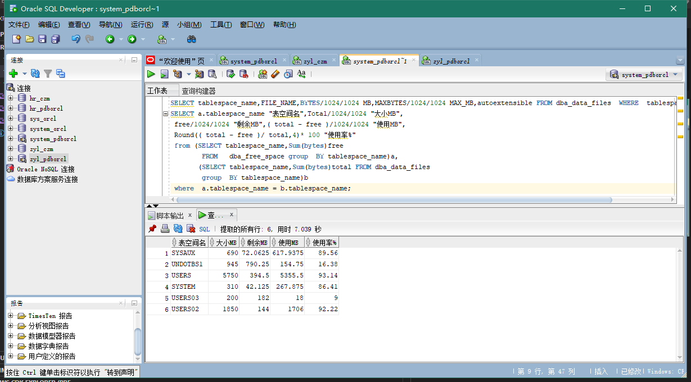
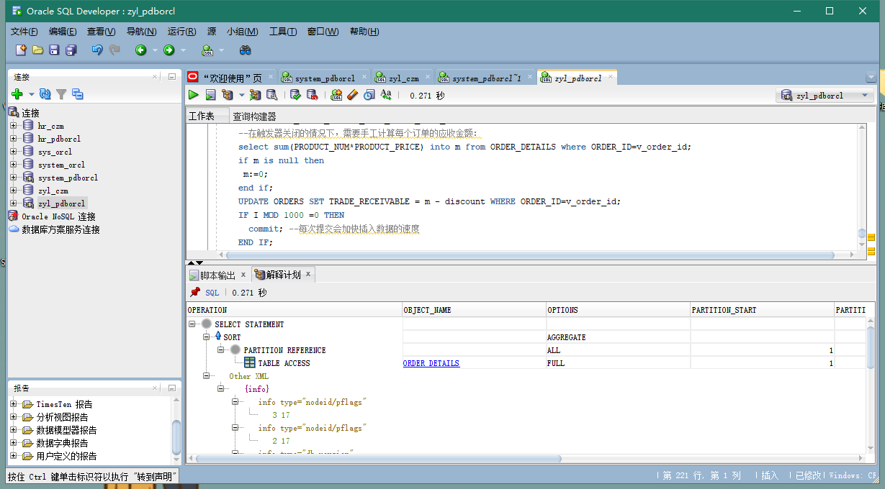

# Test3
## 郑玉铃 201810414204 18软工2班
## github用户名：zyl1075872605
## 实验目的
掌握分区表的创建方法，掌握各种分区方式的使用场景。
## 实验内容

1.本实验使用3个表空间：USERS,USERS02,USERS03。在表空间中创建两张表：订单表(orders)与订单详表(order_details)。

2.使用你自己的账号创建本实验的表，表创建在上述3个分区，自定义分策略。

3.你需要使用system用户给你自己的账号分配上述分区的使用权限。你需要使用system用户给你的用户分配可以查询执行计划的权限。

4.表创建成功后，插入数据，数据能并平均分布到各个分区。每个表的数据都应该大于1万行，对表进行联合查询。

5.写出插入数据的语句和查询数据的语句，并分析语句的执行计划。

6.进行分区与不分区的对比实验。

## 实验步骤

在主表orders和从表order_details之间建立引用分区 在study用户中创建两个表：orders（订单表）和order_details（订单详表），两个表通过列order_id建立主外键关联。orders表按范围分区进行存储，order_details使用引用分区进行存储。

1、创建自己的user_zyl账号

2、以user_zyl运行test3.sql脚本文件

3、以system运行test3.sql脚本文件

    --以system用户运行：
    set autotrace on

    select * from user_zyl.orders where order_date
    between to_date('2017-1-1','yyyy-mm-dd') and to_date('2018-6-1','yyyy-mm-dd');

    select a.ORDER_ID,a.CUSTOMER_NAME,
    b.product_name,b.product_num,b.product_price
    from user_zyl.orders a,user_zyl.order_details b where
    a.ORDER_ID=b.order_id and
    a.order_date between to_date('2017-1-1','yyyy-mm-dd') and to_date('2018-6-1','yyyy-mm-dd');

3、查看数据库的使用情况

autoextensible是显示表空间中的数据文件是否自动增加。
MAX_MB是指数据文件的最大容量。

4、执行计划分析
在主表orders和从表order_details之间建立引用分区 在user_zyl用户中创建两个表：orders（订单表）和order_details（订单详表），两个表通过列order_id建立主外键关联。orders表按范围分区进行存储，order_details使用引用分区进行存储。 

5、实验总结与体会
通过本次实验，我掌握了分区表的创建方法和各种分区方式的使用场景。
